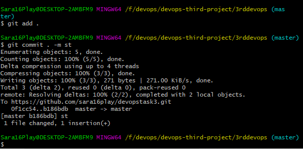
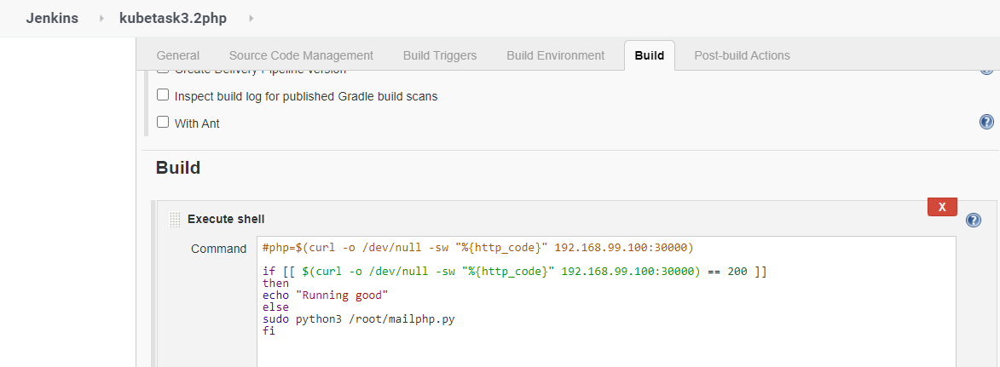

# Problem Statement

Perform second task on top of Kubernetes where we use Kubernetes resources like Pods, ReplicaSet, Deployment, PVC and Service.

1. Create container image that’s has Jenkins installed  using dockerfile  Or You can use the Jenkins Server on RHEL 8/7

2.  When we launch this image, it should automatically starts Jenkins service in the container.

3.  Create a job chain of job1, job2, job3 and  job4 using build pipeline plugin in Jenkins 

4.  Job1 : Pull  the Github repo automatically when some developers push repo to Github.

5.  Job2 : 

    1. By looking at the code or program file, Jenkins should automatically start the respective language interpreter installed image container to deploy code on top of Kubernetes ( eg. If code is of  PHP, then Jenkins should start the container that has PHP already installed )

    2. Expose your pod so that testing team could perform the testing on the pod

    3. Make the data to remain persistent ( If server collects some data like logs, other user information )

6.  Job3 : Test your app if it is working or not.

7.  Job4 : if app is not working , then send email to developer with error messages and redeploy the application after code is being edited by the developer

## My Solution for this problem is:
 

### Initial steps:

* Create the repository from where developer will push the code.

* Configure the hooks so that whenever the developer commit the code it will automaically puch the code to github.



### Step 1: Create container image that’s has Jenkins installed  using dockerfile  Or You can use the Jenkins Server on RHEL 8/7:

* I have used the Jenkins Server on RHEL 8.

### Step 2: Automatically starts the jenkins services:

* As using the RHEL 8 so, it start the jenkins server on port no 8080.

### Step 3: Creating the job chain using build pipeline:


### Step 4: 

#### JOB 1: Pulling the repo.:


### Step 5: 

#### JOB 2: 

* By looking at the code or program file, Jenkins should automatically start the respective language interpreter installed image container to deploy code on top of Kubernetes ( eg. If code is of  PHP, then Jenkins should start the container that has PHP already installed )

* Expose your pod so that testing team could perform the testing on the pod

* Make the data to remain persistent ( If server collects some data like logs, other user information )


* This is code of launcing the pods in the jenkins

```
cd /kubetask3
if ls | grep .php
then
if sudo kubectl get pods | grep phpos
then
statusphp=$(sudo kubectl get pods --selector=app=php -o jsonpath="{.items[*].status.phase}")
if [[ $statusphp == Running ]]
then
echo "running"
PHP=$(sudo kubectl get pod -l app=php -o jsonpath="{.items[0].metadata.name}")
sudo kubectl cp /kubetask3/index.php $PHP:/var/www/html/
sudo kubectl cp /kubetask3/images $PHP:/var/www/html/
else
echo $statusphp
fi
else
sudo kubectl create -f /root/task3.yml
statusphp=$(sudo kubectl get pods --selector=app=php -o jsonpath="{.items[*].status.phase}")
while [[ $statusphp != Running ]]
do
statusphp=$(sudo kubectl get pods --selector=app=php -o jsonpath="{.items[*].status.phase}")
done
PHP=$(sudo kubectl get pod -l app=php -o jsonpath="{.items[0].metadata.name}")
sudo kubectl cp /kubetask3/index.php $PHP:/var/www/html/
sudo kubectl cp /kubetask3/images $PHP:/var/www/html/
fi
fi


cd /kubetask3
if ls | grep .html
then
if sudo kubectl get pods | grep htmlos
then
statushtml=$(sudo kubectl get pods --selector=app=html -o jsonpath="{.items[*].status.phase}")
if [[ $statushtml == Running ]]
then
echo "running"
HTML=$(sudo kubectl get pod -l app=html -o jsonpath="{.items[0].metadata.name}")
sudo kubectl cp /kubetask3/index.html $HTML:/usr/local/apache2/htdocs
sudo kubectl cp /kubetask3/images $HTML:/usr/local/apache2/htdocs
else
echo $statushtml
fi
else
sudo kubectl create -f /root/task3httpd.yml
statushtml=$(sudo kubectl get pods --selector=app=html -o jsonpath="{.items[*].status.phase}")
while [[ $statushtml != Running ]]
do
statushtml=$(sudo kubectl get pods --selector=app=html -o jsonpath="{.items[*].status.phase}")
done
HTML=$(sudo kubectl get pod -l app=html -o jsonpath="{.items[0].metadata.name}")
sudo kubectl cp /kubetask3/index.html $HTML:/usr/local/apache2/htdocs
sudo kubectl cp /kubetask3/images $HTML:/usr/local/apache2/htdocs
fi
fi
```

* This is code to launch the pods in the kubernetes


```
For php:

kind: PersistentVolumeClaim
apiVersion: v1
metadata:
  name: task3pvc-php
  labels:
    name: task3-pvc-php
spec:
  accessModes:
    - ReadWriteOnce
  resources:
    requests:
      storage: 2Gi
---
apiVersion: apps/v1
kind: ReplicaSet
metadata:
  name: phpos
  labels:
    app: task3label-php
spec:
  replicas: 1
  selector:
    matchLabels:
       app: php
  template:
    metadata:
     name: myweb-pod-php
     labels:
       app: php
    spec:
      containers:
      - name: task3pod-php
        image: vimal13/apache-webserver-php
        volumeMounts:
        - name: task3vol-php
          mountPath: /var/www/html/
      volumes:
      - name: task3vol-php
        persistentVolumeClaim:
          claimName: task3pvc-php
---
apiVersion: v1
kind: Service
metadata:
  name: task3service
  labels:
    app: task3label
spec:
  selector:
    app: php
  type: NodePort
  ports:
    - nodePort: 30000
      port: 81
      targetPort: 80

```


```
For html

apiVersion: v1
kind: PersistentVolumeClaim
metadata:
  name: task3pvc-httpd
  labels:
    name: task3-pvc-httpd
spec:
  accessModes:
   - ReadWriteOnce
  resources:
    requests:
      storage: 2Gi
---
apiVersion: apps/v1
kind: ReplicaSet
metadata:
  name: htmlos
  labels:
    app: task3label-httpd
spec:
  replicas: 1
  selector:
    matchLabels:
       app: html
  template:
    metadata:
     name: myweb-pod-httpd
     labels:
       app: html
    spec:
      containers:
      - name: task3pod-httpd
        image: httpd
        volumeMounts:
        - name: task3vol-httpd
          mountPath: /usr/local/apache2/htdocs/
      volumes:
      - name: task3vol-httpd
        persistentVolumeClaim:
          claimName: task3pvc-httpd
---
apiVersion: v1
kind: Service
metadata:
  name: task3service-httpd
  labels:
    app: task3label-httpd
spec:
  selector:
    app: html
  type: NodePort
  ports:
    - nodePort: 30001
      port: 82
      targetPort: 80

```

* These code will fullfil all the job 2 requirements.

### Step 6 & 7: 

#### Job3 : Test your app if it is working or not.

####  Job4 : If app is not working , then send email to developer with error messages and redeploy the application after code is being edited by the developer

* For PHP ( Testing and sending mail )




```
if [[ $(curl -o /dev/null -sw "%{http_code}" 192.168.99.100:30000) == 200 ]]
then
echo "Running good"
else
sudo python3 /root/mailphp.py
fi
```

* For HTML ( Testing and sending mail )


```
if [[ $(curl -o /dev/null -sw "%{http_code}" 192.168.99.100:30001) == 200 ]]
then
echo "Running good"
else
sudo python3 /root/mailhtml.py
fi
```

* After sending the mail developer will change the code and commit to git then this process will again start.

### Outputs:

* After running the jobs we have to enter the ip of the host os and the port no which we have given to expose...


### Note

The pods are launced using Replica set so it will monitor the continers running, if they fails or stops by any reasons then ReplicaSet automatically starts or launch the OS within a sec with the same confirguration.

Some kubernetes Screenshots after running the all the jobs..


## Built With

* RHEL-8 Running in Virtual Box
* Kubernetes installed by minikube and also running in RHEL 8
* Git & GitHub
* Jenkins

## Author

[SAURAV PATEL](https://www.linkedin.com/in/saurav-patel-148539151/)
